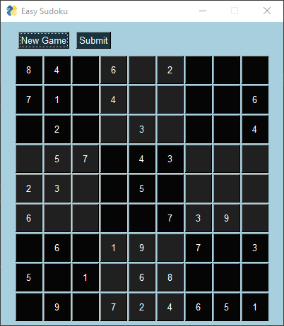
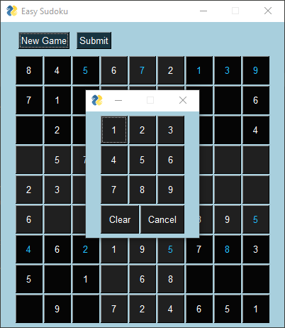
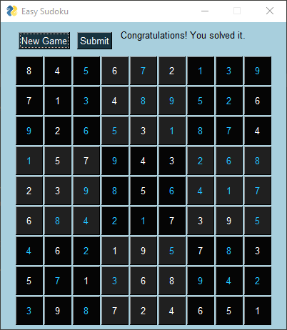
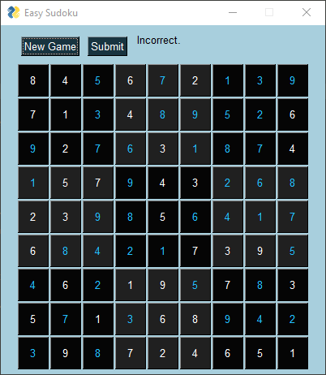

# Easy-Sudoku

Easy Sudoku is a sudoku game with GUI.

1) Automatically generates sudoku puzzles through random transformation of common sudoku patterns which achieves a very large number of possible puzzles and therefore avoids repetitiveness.

2) Finds solution to any generated grid.

3) Is user-friendly thanks to the use of a GUI. 

4) Allows user easily enter or clear previously-entered values into sudoku squares through a pop-up numpad. 

5) Allows user submit their answer and check for its validity. 
 

